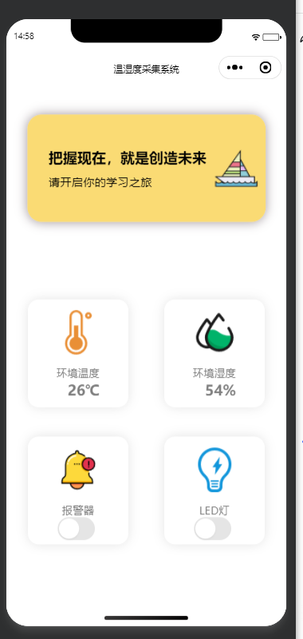

# STM32 + ESP8266 + OneNET 物联网温湿度监控系统

## 项目简介

基于 STM32F103ZET6 + ESP8266 + DHT11 的物联网温湿度监控系统，配套微信小程序，实现远程数据监控和指令下发。

**系统包含三部分：**

| 部分 | 说明 |
|------|------|
| **设备端** | STM32 + ESP8266 + DHT11，采集温湿度、控制 LED/蜂鸣器 |
| **云平台** | OneNET，数据存储、指令转发 |
| **用户端** | 微信小程序，显示数据、下发控制指令 |

---

## 硬件清单

| 模块 | 型号 | 说明 |
|------|------|------|
| 主控 | 正点原子精英板 STM32F103ZET6 | 72MHz，64KB RAM，512KB Flash |
| WiFi | ESP-01S (ESP8266) | AT 固件，1MB Flash |
| 温湿度 | DHT11 | 单总线，温度 ±2°C，湿度 ±5% |
| 调试 | ST-Link V2 | SWD 模式 |
| 调试 | USB 转串口 | USART1，115200 |

## 总体架构
```

┌─────────────────────────────────────────────────────────────────────────────┐
│                              用户层                                          │
│                                                                             │
│   ┌─────────────────────┐                                                  │
│   │    微信小程序       │                                                  │
│   │                     │                                                  │
│   │  - 温度显示 26°C    │                                                  │
│   │  - 湿度显示 55%     │                                                  │
│   │  - LED 开关         │                                                  │
│   │  - 报警器开关       │                                                  │
│   └──────────┬──────────┘                                                  │
│              │ HTTP（每 5 秒查询 + 手动控制）                               │
└──────────────┼──────────────────────────────────────────────────────────────┘
               │
               ��
┌─────────────────────────────────────────────────────────────────────────────┐
│                              云平台层                                        │
│                                                                             │
│   ┌─────────────────────────────────────────────────────────────────────┐  │
│   │                        OneNET 云平台                                │  │
│   │                                                                     │  │
│   │  - 设备管理                                                         │  │
│   │  - 数据存储（Temp / Hum）                                           │  │
│   │  - 属性查询 API                                                     │  │
│   │  - 属性设置 API（转发 LED / Alarm 指令）                            │  │
│   └──────────────────────────┬──────────────────────────────────────────┘  │
│                              │ MQTT（双向）                                  │
└──────────────────────────────┼──────────────────────────────────────────────┘
                               │
                               ��
┌─────────────────────────────────────────────────────────────────────────────┐
│                              设备层                                          │
│                                                                             │
│   ┌─────────────────────┐         ┌─────────────────────┐                  │
│   │     ESP8266         │?�T�T�T�T�T�T�T?│   STM32 + FreeRTOS  │                  │
│   │   WiFi + MQTT       │         │                     │                  │
│   │                     │         │  - DHT11 采集       │                  │
│   │  - 上报数据         │         │  - 数据上报         │                  │
│   │  - 接收指令         │         │  - 指令处理         │                  │
│   └─────────────────────┘         └─────────────────────┘                  │
│                                                                             │
└─────────────────────────────────────────────────────────────────────────────┘

```
##  串口接收架构（IDLE + DMA + 双队列）
```
┌─────────────────────────────────────────────────────────────────────┐
│                      串口接收数据流                                  │
│                                                                     │
│  ESP8266 发送数据                                                   │
│       │                                                             │
│       ��                                                             │
│  ┌─────────────────────────────────────────────┐                    │
│  │  USART2 RX 引脚                             │                    │
│  └──────────────────┬──────────────────────────┘                    │
│                     │                                               │
│                     ��                                               │
│  ┌─────────────────────────────────────────────┐                    │
│  │  DMA1_Channel6（循环模式，无中断）          │                    │
│  │  自动搬运到 usart2_dma_rx_buf[512]          │                    │
│  └──────────────────┬──────────────────────────┘                    │
│                     │                                               │
│                     ��                                               │
│  ┌─────────────────────────────────────────────┐                    │
│  │  USART2 IDLE 中断（一帧数据接收完成）        │                    │
│  │  - 清除 IDLE 标志（先读 SR，再读 DR）        │                    │
│  │  - 关闭 DMA，计算接收长度                    │                    │
│  │  - 调用 ESP8266_DispatchFrame 分拣           │                    │
│  │  - 重置 DMA，重新使能                        │                    │
│  └──────────────────┬──────────────────────────┘                    │
│                     │                                               │
│                     ��                                               │
│  ┌─────────────────────────────────────────────┐                    │
│  │  ESP8266_DispatchFrame（分拣器）             │                    │
│  │                                              │                    │
│  │  查找 "+IPD" 前缀：                          │                    │
│  │    ├── 有 +IPD → MQTT 队列                   │                    │
│  │    └── 无 +IPD → AT 队列                     │                    │
│  └──────┬───────────────────────┬──────────────┘                    │
│         │                       │                                  │
│         ��                       ��                                  │
│  ┌──────────────┐        ┌──────────────┐                          │
│  │ AT 队列      │        │ MQTT 队列    │                          │
│  │              │        │              │                          │
│  │ AT 响应      │        │ +IPD 数据    │                          │
│  │ OK/ERROR/    │        │ MQTT 包      │                          │
│  │ ready 等     │        │              │                          │
│  └──────┬───────┘        └──────┬───────┘                          │
│         │                       │                                  │
│         ��                       ��                                  │
│  ┌──────────────┐        ┌──────────────┐                          │
│  │ WiFi_Task    │        │ ParserTask   │                          │
│  │              │        │              │                          │
│  │ 同步等待     │        │ 异步解析     │                          │
│  │ AT 响应      │        │ MQTT 包      │                          │
│  └──────────────┘        └──────────────┘                          │
└─────────────────────────────────────────────────────────────────────┘

```

## 小程序

```
小程序 → HTTP GET  → OneNET → 返回 Temp/Hum
小程序 → HTTP POST → OneNET → 转发指令到设备
```
## 功能列表

| 功能 | 状态 | 说明 |
|------|------|------|
| WiFi 连接 | √ | 支持断线自动重连 |
| MQTT 连接 OneNET | √ | 支持指数退避 |
| 心跳保活 | √ | 每 30 秒发 Ping |
| 订阅主题 | √ | 支持重新订阅 |
| DHT11 温湿度采集 | √ | 每 5 秒一次 |
| 数据上报 | √ | 每 5 秒一次 |
| 云端指令下发 | √ | 支持 LED / 蜂鸣器 |
| 断线自动重连 | √ | WiFi + MQTT |
| 指数退避 | √ | 5→10→20→40→60 秒 |
| 栈溢出检测 | √ | `configCHECK_FOR_STACK_OVERFLOW = 2` |
| 断线统计 | √ | 每 60 秒打印 |
| 微信小程序 | √ | 显示数据 + 控制设备 |

## 关键配置

### OneNET 配置

```c
#define ONENET_PRODID   "your_product_id"
#define ONENET_DEVNAME  "your_device_name"
#define ONENET_APIKEY   "your_api_key"
```

### WiFi 配置

```c
#define WIFI_SSID       "your_wifi_ssid"
#define WIFI_PASSWORD   "your_wifi_password"
```

### 时间间隔

```c
#define WIFI_CHECK_INTERVAL_MS    30000   // WiFi 状态查询间隔：30 秒
#define PING_INTERVAL_MS          30000   // MQTT 心跳间隔：30 秒
#define PINGRESP_TIMEOUT_MS       90000   // PINGRESP 超时阈值：90 秒
#define SENSOR_INTERVAL_MS        5000    // 传感器采集间隔：5 秒
#define STATS_PRINT_INTERVAL_MS   60000   // 断线统计打印间隔：60 秒
```

## 编译与烧录

### 环境

- Keil MDK 5.x
- STM32F10x 标准库
- FreeRTOS
- cJSON
- MqttKit

### 编译

1. 打开 `basic_project.uvprojx`
2. 编译（F7）
3. 烧录（F8）

### 烧录配置

- **ST-Link V2**：SWD 模式
- **串口下载**：USART1，115200

## ESP8266 固件烧录

| 配置项 | 值 |
|--------|-----|
| 固件 | (1471)ESP8266-AT-1M.bin |
| SPI MODE | DOUT |
| Flash Size | 8Mbit |
| 烧录地址 | 0x00000 |
| 波特率 | 115200 |

## 调试经验

### 1. AT 指令发不出去

**原因**：`Usart_SendString` 中的地址检查误杀了 Flash 中的常量字符串 `"AT"`。

**解决**：去掉地址范围检查，只保留 `len` 和 `NULL` 检查。

### 2. DHT11 在 FreeRTOS 下读取失败

**原因**：正点原子的 `delay_us` 在 FreeRTOS 下用 `vTaskSuspendAll`，开销大，导致 DHT11 时序错乱。

**解决**：用 SysTick->VAL 独立实现 `DHT11_DelayUs`，只读 SysTick，不修改配置。

### 3. ESP8266 卡在透传模式

**原因**：`AT+CIPSEND` 后没发完整数据，ESP8266 卡在透传模式。

**解决**：发送 `+++` 退出透传，或重新烧录固件。

### 4. MQTT 频繁重连

**原因**：PINGRESP 误判、WiFi 查询太频繁、OneNET 限流。

**解决**：
- 收到 PUBLISH/PINGRESP/SUBACK 都刷新心跳时间
- WiFi 查询间隔改为 30 秒
- 上报间隔改为 10 秒
- 指数退避 5→10→20→40→60 秒
### 5. 微信小程序真机布局不一致

**现象**：开发者工具两列，真机一列。

**原因**：卡片宽度 290rpx + margin 60rpx × 2 = 700rpx > 容器 690rpx，真机换行。

**解决**：卡片宽度改为 270rpx，或改用 48% + box-sizing: border-box。

## 稳定性数据

| 时间 | WiFi lost | PINGRESP timeout | MQTT reconnect |
|------|-----------|------------------|----------------|
| 12 小时 | 0 | 0 | 1 |
| 24 小时 | 0 | 0 | 1 |
| 一周 | 0 | 0 | 2 |
**达到工业级设备稳定性要求。**

## 作者

- 刘朝宇
- 159708944@qq.com

